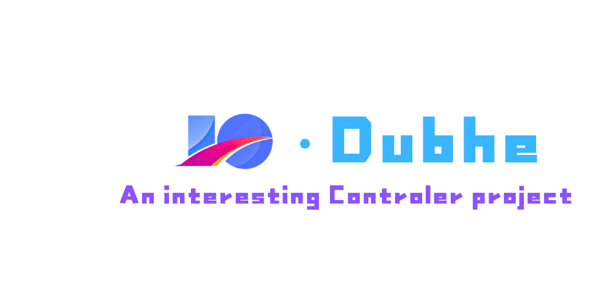

# Dubhe 遥控器项目



## 硬件设计

### 主控系统
- 主控：STM32F407IGT6
- 无线模块：NRF24L01
- 显示：3.5寸IPS显示屏 480*320 16位IPS电容触摸屏
- 通道：32个物理通道
- 高频头：支持常见品牌的高频头
- 图传：支持图传系统（自带的配件或手机APP）
- 摇杆：RDC90

### 电源设计
锂电池充电仓，锂电池供电

### 信号设计
CRSF协议

### 显示设计
3.5寸IPS显示屏 480*320 16位IPS电容触摸屏

### 图传系统
图传系统是一个可选配的独立模块，图传系统的主控使用RK3588作为主控，采用定制化的linux系统，支持模拟器，使得用户无需真实飞行设备即可体验图传系统。

图传系统的另一个作用是能够采集并记录遥控器的实时数据，并记录在数据库中，数据库使用自主实现的一个嵌入式关系型数据库epiphanyDB。

图传系统采用性能较高的主控的另一个考虑是需要图传系统能够进行边缘计算的任务，如自主飞行、AI识别等。

### 通信设计
NRF24L01

### 电池设计
锂电池充电仓，锂电池供电

### 机械设计
机械设计我们使用solidworks软件进行设计，外壳使用ABS材料。在确保强度和刚度的前提下，尽量减小外壳的厚度，以减小重量。外形设计参考了常见的遥控器。

### 电气设计
电路设计采用模块化设计思路，主要包括以下几个部分：

- 电源管理模块：负责电池充放电管理、电压转换和稳压
- 主控模块：基于STM32F407IGT6，负责核心逻辑处理
- 通信模块：基于NRF24L01，负责与飞行器的无线通信
- 显示模块：驱动3.5寸IPS显示屏，提供用户界面
- 输入模块：处理摇杆（RDC90）、按键和触摸屏的输入
- 扩展接口：用于连接高频头和图传模块

电路板采用四层板设计，合理布局信号层和电源层，有效减少电磁干扰。特别注意无线通信部分的信号完整性设计。

## 开发环境
- 编译工具链：arm-none-eabi-gcc
- 开发环境：VSCode
- 构建系统：Make

## 项目结构

```
Dubhe/
├── Core/               # 核心代码
│   ├── Inc/           # 头文件
│   │   ├── main.h
│   │   ├── stm32f4xx_hal_conf.h
│   │   └── stm32f4xx_it.h
│   └── Src/           # 源文件
├── Drivers/           # STM32 HAL库驱动
├── .vscode/           # VSCode配置文件
├── build/             # 编译输出目录
├── Makefile           # 构建脚本
├── STM32F407XX_FLASH.ld # 链接器脚本
├── startup_stm32f407xx.s # 启动文件
└── dubhe.ioc          # STM32CubeMX项目文件
```

核心代码位于Core目录下，分为Inc（头文件）和Src（源文件）两个子目录。STM32相关的驱动文件位于Drivers目录。项目使用Makefile进行构建，编译后的文件输出到build目录。

## 使用说明

### 软件开发环境搭建

1. 安装必要的工具链：
   - arm-none-eabi-gcc（用于编译）
   - GNU Make（用于构建）
   - STM32CubeMX（可选，用于配置）
   - VSCode（推荐的IDE）

2. VSCode插件推荐：
   - C/C++（Microsoft）
   - Cortex-Debug（用于调试）
   - STM32 Snippets（可选）

### CAD软件

1. SolidWorks
2. 嘉立创专业版

### 编译项目

在项目根目录执行：

```bash
make
```

编译后的文件将生成在build目录下：
- dubhe.elf：可执行文件
- dubhe.hex：HEX格式文件，用于烧录
- dubhe.bin：二进制格式文件，用于烧录

### 烧录固件

可以使用ST-Link、J-Link等调试器通过以下工具烧录：
- STM32CubeProgrammer
- OpenOCD
- J-Flash

### 调试

使用VSCode和Cortex-Debug插件可以进行源码级调试。具体配置可参考.vscode目录下的launch.json文件。

## 贡献指南

我们欢迎并感谢任何形式的贡献！如果您想参与本项目，请遵循以下步骤：

1. Fork本仓库
2. 创建您的特性分支：`git checkout -b feature/amazing-feature`
3. 提交您的更改：`git commit -m '添加一些很棒的功能'`
4. 推送到分支：`git push origin feature/amazing-feature`
5. 提交Pull Request

### 编码规范

- 所有C代码遵循[Embedded C Coding Standard](https://barrgroup.com/embedded-systems/books/embedded-c-coding-standard)规范
- 使用4个空格进行缩进，不使用Tab
- 函数和变量命名使用小驼峰命名法（例如：calculatePower）
- 常量和宏定义使用全大写下划线分隔（例如：MAX_POWER_LEVEL）
- 每个函数都应有详细的注释说明其功能、参数和返回值

### Bug报告和功能请求

如果您发现了Bug或有新的功能请求，请创建一个Issue。在描述问题时，请尽可能详细地提供信息，包括：

- 问题的详细描述
- 重现步骤
- 预期行为与实际行为
- 系统环境信息

## 许可证

本项目采用MIT许可证。详情请参阅[LICENSE](LICENSE)文件。

```
MIT License

Copyright (c) 2025 Dubhe开发团队

Permission is hereby granted, free of charge, to any person obtaining a copy
of this software and associated documentation files (the "Software"), to deal
in the Software without restriction, including without limitation the rights
to use, copy, modify, merge, publish, distribute, sublicense, and/or sell
copies of the Software, and to permit persons to whom the Software is
furnished to do so, subject to the following conditions:

The above copyright notice and this permission notice shall be included in all
copies or substantial portions of the Software.

THE SOFTWARE IS PROVIDED "AS IS", WITHOUT WARRANTY OF ANY KIND, EXPRESS OR
IMPLIED, INCLUDING BUT NOT LIMITED TO THE WARRANTIES OF MERCHANTABILITY,
FITNESS FOR A PARTICULAR PURPOSE AND NONINFRINGEMENT. IN NO EVENT SHALL THE
AUTHORS OR COPYRIGHT HOLDERS BE LIABLE FOR ANY CLAIM, DAMAGES OR OTHER
LIABILITY, WHETHER IN AN ACTION OF CONTRACT, TORT OR OTHERWISE, ARISING FROM,
OUT OF OR IN CONNECTION WITH THE SOFTWARE OR THE USE OR OTHER DEALINGS IN THE
SOFTWARE.
```
